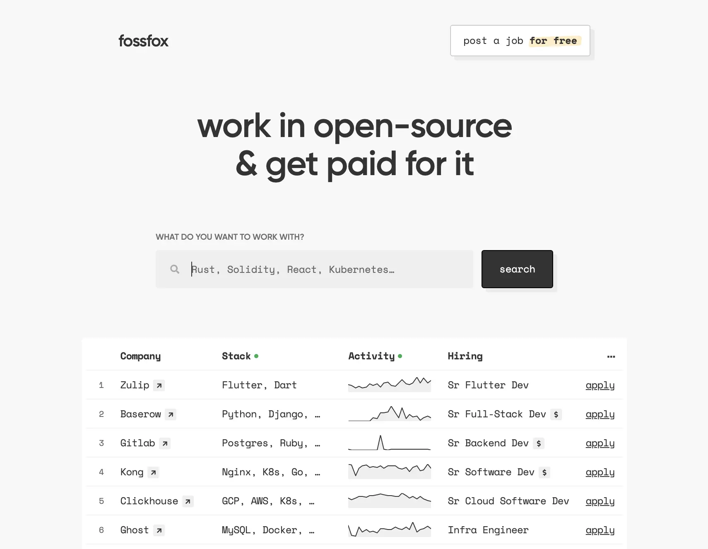

# [Fossfox](https://fossfox.com/) Open Database of Available Engineering Jobs

## What Is Fossfox

[Fossfox](https://fossfox.com/) is a **job board for software engineers**.

It lists available engineering positions of companies whose products are open-source. The goal is to get software engineers better jobs.

## Why Post On Fossfox

1. Posting on Fossfox is free
1. Our audience is tech-savvy software engineers
1. Unlimited posts + traffic to your website

## How To Post

There are 2 ways to post new jobs on Fossfox:

### Option 1: CLI Wizard (requires [Rust](https://www.rust-lang.org/tools/install))

1. Clone this repo
1. Run `cargo run` and follow the wizard

### Option 2: Sample template

1. Clone this repo
1. Copy contents of [data/SAMPLE_COMPANY_TEMPLATE.json](data/SAMPLE_COMPANY_TEMPLATE.json) into a new file (eg: `data/SAMPLE_COMPANY_TEMPLATE.json` → `data/companies/m/my-company.json`)
1. Fill it out with your company details & available engineering roles
1. [Create a pull request](https://docs.github.com/en/pull-requests/collaborating-with-pull-requests/proposing-changes-to-your-work-with-pull-requests/creating-a-pull-request) so we can merge it

> ℹ️ The job posts will automatically appear on [Fossfox](https://fossfox.com/) after your PR will be accepted. Please note that other websites can use this data to display your job posts.

## FAQs

  
How much does it cost?

  Free.

  
Why is it free? What's the catch?

  Our homepage has a limit on how many positions it shows at once. For more visibility we are offering <a href="mailto:support@fossfox.com">sponsored posts</a>.

  
How long will Fossfox stay free?

  Forever.

  
How many jobs can I post?

  Unlimited, as long as they're all part of your engineering team.

  
How long do the posts stay up?

  30 days. After that you can update the timestamp to extend for another 30 days.

  
Can I post non-engineering related job posts?

  No, sorry. This is a dev-only job board.

## Attribution

You can use Fossfox data as long as you give attribution. Attribution needs to have 2 components:

1. Source: "Fossfox"
2. Link: https://fossfox.com

Optional:

If you find this work helpful, feel free to encourage others to add data here. For example:

> If you're growing your engineering team, [submit your open roles](https://github.com/fossfox-com/fossfox) to Fossfox for free.

<ins>Sample attribution</ins>

Data Source: [Fossfox](https://fossfox.com)

If you're growing your engineering team, [submit your open roles](https://github.com/fossfox-com/fossfox) to Fossfox for free.
